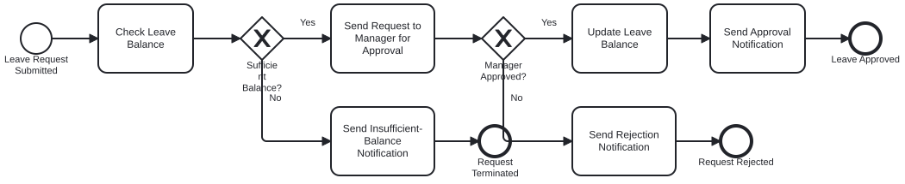
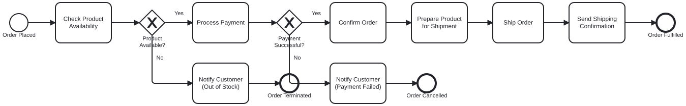
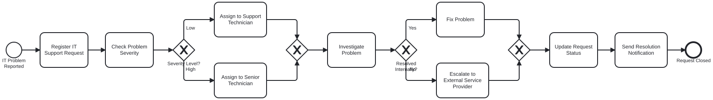

# BPMN Process Modeling Workflows

This repository contains complete BPMN 2.0 process models and diagram assets for three standard business workflows.

---

## Scenario 1: Employee Leave Approval
- **Description:** An employee submits a leave request through the HR system[cite: 1]. The system validates the leave balance, sends the request to the manager if sufficient, updates the balance upon approval, or delivers corresponding rejection/insufficient-balance notifications[cite: 1].
- **Key BPMN Elements:** Start Event, Tasks, Exclusive Gateways (XOR), End Events[cite: 1].

---

## Scenario 2: Online Purchase Order Processing
- **Description:** Initiated when a customer places an order[cite: 1]. The system performs availability and payment checks, prepares the product, ships the order, and dispatches customer notifications at critical failure or completion stages[cite: 1].
- **Key BPMN Elements:** Start Event, Tasks, Exclusive Gateways (XOR), End Events[cite: 1].

---

## Scenario 3: IT Service Request
- **Description:** Initiated when an employee reports an IT problem[cite: 1]. The help desk registers the ticket, classifies severity to assign an appropriate technician, attempts internal resolution, escalates externally if needed, and closes the ticket upon notifying the employee[cite: 1].
- **Key BPMN Elements:** Start Event, Multiple Tasks, Exclusive Gateways (Diverging & Converging), End Event[cite: 1].

